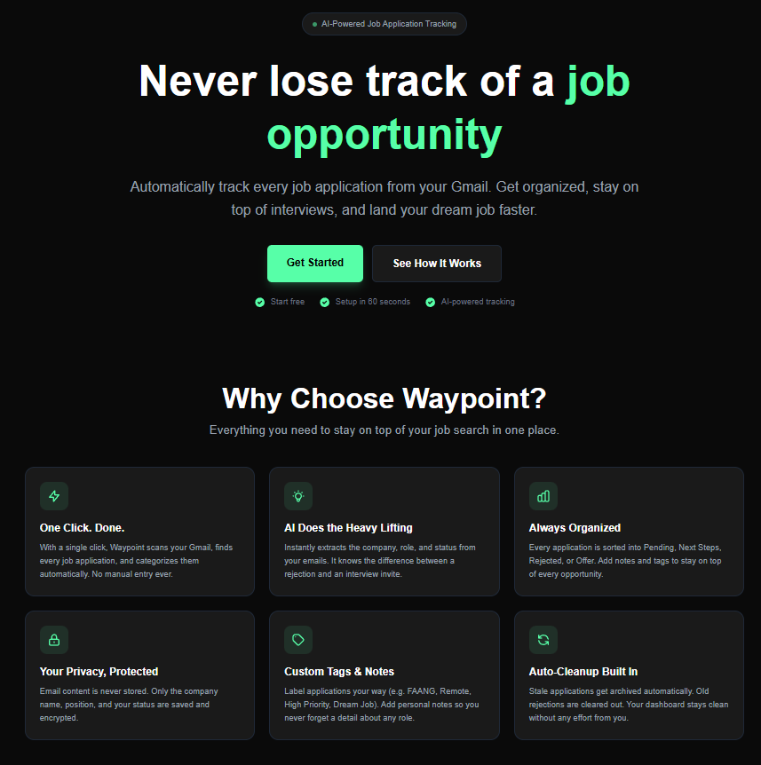
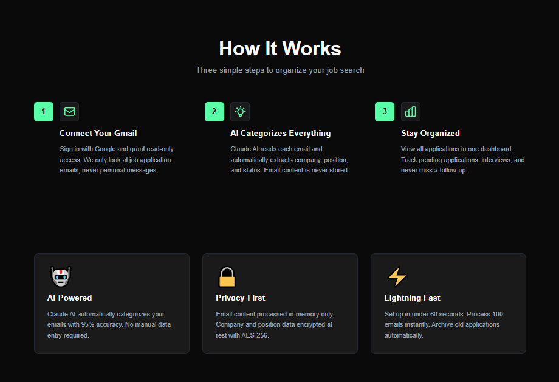

# Waypoint - AI-Powered Job Application Tracker

🚀 **Live:** [joinwaypoint.app](https://joinwaypoint.app)

Never lose track of a job opportunity. Waypoint automatically tracks every job application from your Gmail with AI-powered categorization.

---

## 🎯 What It Does

Waypoint connects to your Gmail, scans for job-related emails, and uses Claude AI to automatically extract:
- Company name
- Job position
- Application status (Pending, Next Step, Rejected, Offer)

Everything organized in one beautiful dashboard.

---

## ✨ Features

- **One-Click Import** - Process 100 emails in seconds
- **AI Categorization** - Claude AI reads and categorizes each application
- **Smart Organization** - Automatically sorts by status with color-coded cards
- **Custom Tags** - Label applications (FAANG, Remote, High Priority, etc.)
- **Notes System** - Add personal notes to each application
- **Auto-Cleanup** - Stale applications auto-archive, old rejections auto-delete
- **Privacy-First** - Email content never stored, only extracted data (AES-256 encrypted)

---

## 🛠️ Tech Stack

- **Frontend:** Next.js 14, React, TypeScript, Tailwind CSS, Framer Motion
- **Backend:** Next.js API Routes, Prisma ORM
- **Database:** PostgreSQL (Neon)
- **Authentication:** NextAuth.js with Google OAuth
- **AI:** Anthropic Claude API (Haiku 3.5)
- **Deployment:** Vercel
- **Email:** Gmail API (read-only scope)

---

## 📸 Screenshots

### Landing Page

### Dashboard

### Application Details

---

## 🔒 Privacy & Security

- **Read-Only Gmail Access** - Can never send, delete, or modify emails
- **Zero Email Storage** - Email content processed in-memory only
- **Encrypted Data** - Company/position data encrypted at rest (AES-256-GCM)
- **Compliant** - Follows Google API Services User Data Policy

---

## 🚀 Key Accomplishments

- Built full-stack SaaS application from scratch in Next.js
- Integrated Claude AI for intelligent email parsing (95%+ accuracy)
- Implemented secure OAuth 2.0 flow with Gmail API
- Designed and implemented end-to-end encryption for sensitive data
- Created responsive dark-themed UI with Tailwind CSS
- Deployed production app with custom domain
- Prepared for Google OAuth verification process

---

## 📝 Note

This is a showcase repository for portfolio purposes. The source code is kept private. For inquiries or demo access, please contact me directly.

---

## 📧 Contact

- **Email:** haykvadan@gmail.com
- **LinkedIn:** https://www.linkedin.com/in/haykvardapetyan/

---

© 2026 Waypoint. All rights reserved.